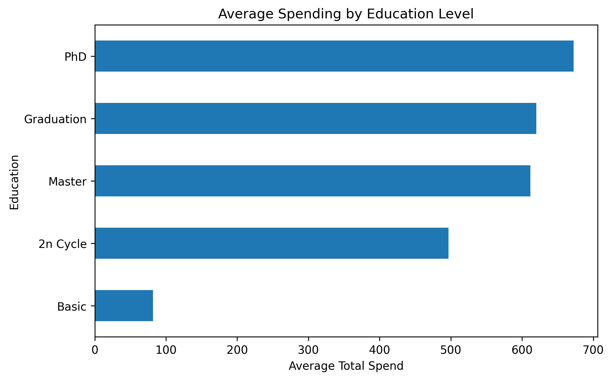

# Growth Advisor AI

## Executive Summary

Built a customer intelligence and marketing analytics solution using Python, customer segmentation techniques, and exploratory data analysis.

The project analyzes 2,240 customer records to identify high-value customers, uncover spending patterns, and generate actionable business insights that can improve marketing targeting, customer retention, and revenue growth.

The analysis demonstrates how data-driven decision-making can help organizations better understand customer behavior and optimize marketing strategies.

---

## Project Overview

Growth Advisor AI is a customer intelligence and customer segmentation project built using the Customer Personality Analysis dataset.

The objective of this project is to identify high-value customers, analyze purchasing behavior, and generate actionable business insights that can support marketing optimization, customer retention, and revenue growth strategies.

By combining exploratory data analysis, customer segmentation techniques, and feature engineering, the project demonstrates how data-driven decision-making can help businesses better understand their customers and allocate marketing resources more effectively.

---

## Business Problem

Marketing teams often struggle to identify which customers generate the greatest value for the business.

This project addresses the following questions:

* Who are the highest-value customers?
* What characteristics distinguish top spenders from regular customers?
* How do income, education, and marital status influence purchasing behavior?
* How can customer segmentation improve marketing effectiveness?

---

## Dataset

**Dataset:** Customer Personality Analysis

**Source:** Marketing customer behavior dataset

### Dataset Summary

* 2,240 customer records
* 29 customer attributes
* Demographic information
* Income and household characteristics
* Product spending categories
* Purchase channels
* Campaign response history

---

## Data Preparation

The following preprocessing steps were performed:

* Missing income values were identified and imputed using the median income.
* Customer spending across product categories was combined into a new feature called **TotalSpend**.
* High-value customers were identified using the top 10% spending threshold.
* Customer segmentation labels were created for further analysis.

---

## Key Findings

### Customer Segmentation

* Top 10% of customers were classified as **High Value Customers**.
* High-value customers have an average income of approximately **$80,000**, compared to **$49,000** for regular customers.
* High-value customers spend nearly **four times more** than regular customers.
* Customers with higher education levels are more likely to belong to the high-value segment.
* Married and partnered customers represent the largest share of top spenders.

### Education Insights

Analysis shows that customers with:

* PhD degrees
* Master's degrees
* Graduation-level education

demonstrate the highest average spending levels.

### Income Insights

Income is strongly associated with customer value:

* Regular Customers: ~$49,000 average income
* High-Value Customers: ~$80,000 average income

This suggests income is an important predictor of spending behavior.

---

## Business Impact

The analysis demonstrates that customer value is strongly associated with income, education level, and purchasing behavior.

These insights can help businesses:

- Identify high-value customer segments
- Improve marketing campaign targeting
- Increase customer retention
- Optimize marketing budget allocation
- Support data-driven business decisions

By focusing on customers with characteristics similar to top spenders, organizations can improve marketing efficiency and maximize return on investment.

---

## Business Recommendations

Based on the analysis, organizations should:

- Focus marketing campaigns on high-income customer segments
- Create premium offers for highly educated customers
- Develop retention programs for top-spending customers
- Use customer segmentation to improve campaign ROI

---

## Skills Demonstrated

* Customer Analytics
* Marketing Analytics
* Customer Segmentation
* Exploratory Data Analysis (EDA)
* Data Cleaning
* Feature Engineering
* Data Visualization
* Business Intelligence
* Python
* Pandas
* NumPy
* Matplotlib

---

## Technologies Used

* Python
* Pandas
* NumPy
* Matplotlib
* Scikit-Learn
* Jupyter Notebook
* VS Code
* GitHub

---

## Project Structure

```text
GrowthAdvisorAI/

├── data/
│   └── marketing_campaign.csv
│
├── notebooks/
│   └── 01_customer_intelligence_analysis.ipynb
│
├── reports/
│
├── screenshots/
│   └── education_spending_analysis.png
│
├── README.md
├── requirements.txt
└── .gitignore
```

---

## Future Enhancements

Future versions of the project may include:

* Machine Learning customer classification models
* Customer Lifetime Value (CLV) prediction
* Marketing campaign response prediction
* Interactive dashboard development
* Automated customer segmentation recommendations

---

## Author

**Maryia Zaitsava**

Boston University
Master of Science in Data Science

Focus Areas:

* Marketing Analytics
* Customer Intelligence
* Predictive Analytics
* AI for Business

---

## Sample Visualizations

### Spending by Education Level

Customers with higher education levels demonstrate significantly higher spending behavior.

PhD, Master's, and Graduation-level customers generate the highest average spending, suggesting that education may be a useful segmentation variable for targeted marketing campaigns.

